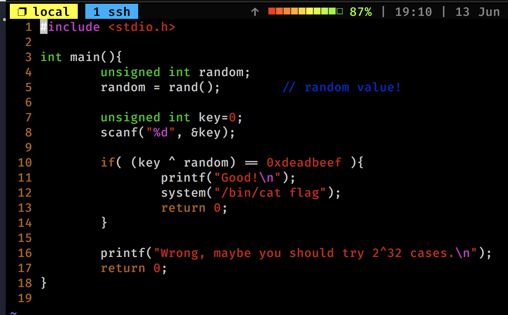
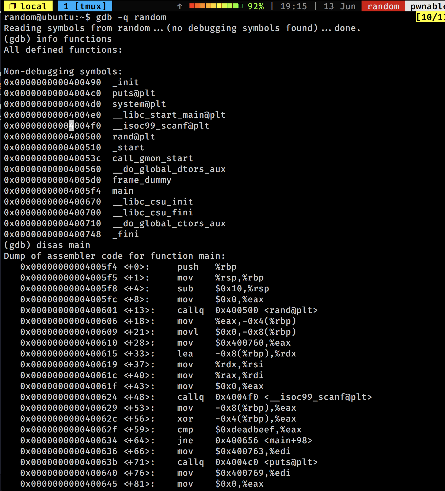
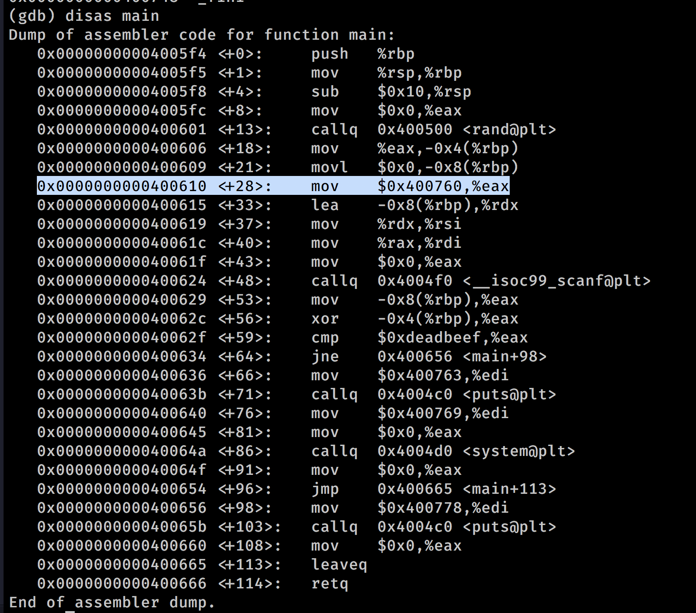
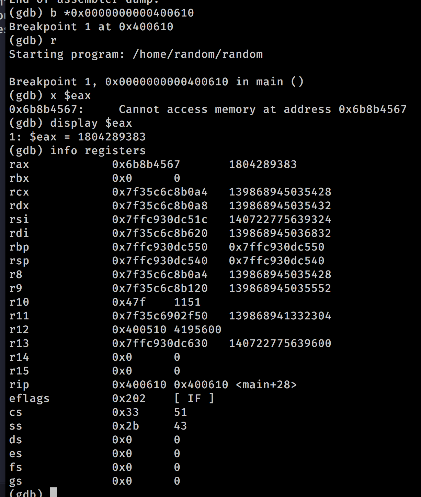
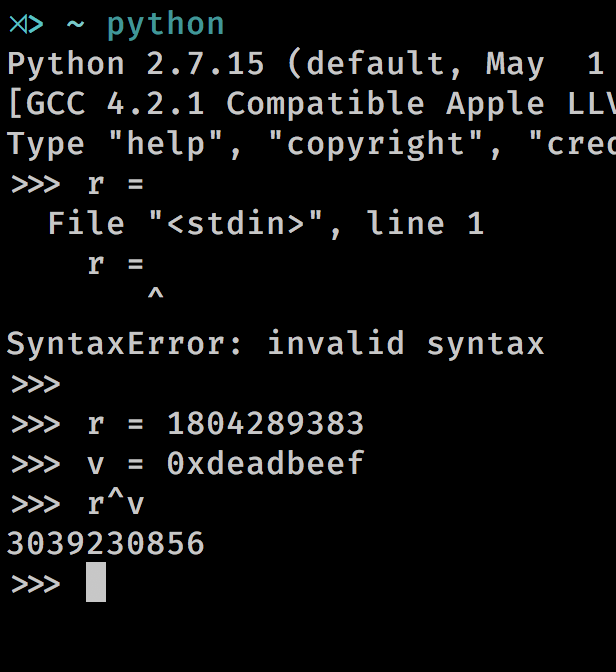
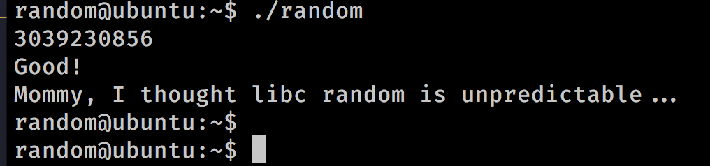

random
======

1. Let's ssh to the box `ssh random@pwnable.kr -p2222` # guest

2. A quick rundown of the 20 lines of code tells us that the required line number we need to bypass is L10 where an input `key` is XORed with an `"unseeded" random number generated by libc` and equated to `0xdeadbeef`. The latter part of the previous statement is the key info here. Since, we don't know what the random number generated will be, let's just try to figure that out first.

3. Load up the compiled binary in GDB, `gdb -q random` (-q to suppress gdb terms and warnings).

4. First, check the functions present in the binary. We are only intersted in `main` for now.

5. Let's disassemble `main`. Now, I am not going to go deep into this, but try to step each line / or a small chunk of assemble with each line of the code carefully. We see that on line highlighted in the picture, register $eax is being moved to  (which corresponds to our random number). 

6. Let's put a breakpoint on this line and run the program. The program pauses the run at the exact instruction address we needed. 

7. Lets try to figure out what our dear register $eax holds. 

Note 1. `x $reg` dereferences the memory address pointed at by register $reg (means, it goes to the address held by $reg, gets the raw value there and spits it out)
Note 2. You can additionally typecast the value into int, str, or any other data type.

We will use `display $reg` or `info registers` which spits out all the values held by all the registers at the current step of execution here. 

8. We got our value, yayy! Let's go ahead and find out the key (remember, XOR is commutative). (Note: python may have auto-typecasted to match the operands' types before applying the ^/XOR operation.)

9. Let's go ahead, `continue`. Yas! We're good to go, but wait. GDB runs our program in a sandboxed environment for X user, which doesn't have permissions to read the flag (even though setuid bit is set for the binary).

10. No worries, let's quit gdb. Run the program and input the key, and voila! 

Asides:

1. What's an unseeded pseudo-random number generater?
- TODO

2. What's setuid or suid bit?
- setuid / suid bit, when enabled allows the program run by A, to pretend as being run by another user B, and give up privileges (ideally! by using seteuid / set effective user ID). A common example is `passwd` binary. 